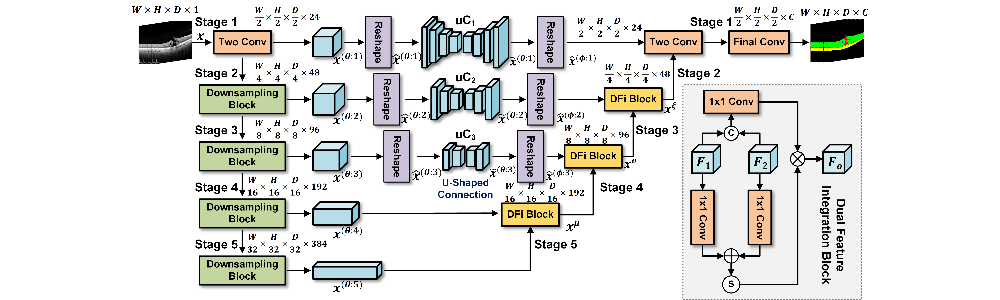

<div align="center">
  <h1>Upping the Game: How 2D U-Net Skip Connection Flip 3D Segmentation</h1>
  <h2>NeurIPS 2024 (poster)</h2>
</div>

## [Project page](https://github.com/IMOP-lab/U-Shaped-Connection-Pytorch) | [Our laboratory home page](https://github.com/IMOP-lab)

## 📖 Abstract

In the present study, we introduce an innovative structure for 3D medical image segmentation that effectively integrates 2D U-Net-derived skip connections into the architecture of 3D convolutional neural networks (3D CNNs). Conventional 3D segmentation techniques predominantly depend on isotropic 3D convolutions for the extraction of volumetric features, which frequently engenders inefficiencies due to the varying information density across the three orthogonal axes in medical imaging modalities such as computed tomography (CT) and magnetic resonance imaging (MRI). This disparity leads to a decline in axial-slice plane feature extraction efficiency, with slice plane features being comparatively underutilized relative to features in the time-axial. To address this issue, we introduce the U-shaped Connection (uC), utilizing simplified 2D U-Net in place of standard skip connections to augment the extraction of the axial-slice plane features while concurrently preserving the volumetric context afforded by 3D convolutions. Based on uC, we further present uC 3DU-Net, an enhanced 3D U-Net backbone that integrates the uC approach to facilitate optimal axial-slice plane feature utilization. Through rigorous experimental validation on five publicly accessible datasets—FLARE2021, OIMHS, FeTA2021, AbdomenCT-1K, and BTCV, the proposed method surpasses contemporary state-of-the-art models. Notably, this performance is achieved while reducing the number of parameters and computational complexity. This investigation underscores the efficacy of incorporating 2D convolutions within the framework of 3D CNNs to overcome the intrinsic limitations of volumetric segmentation, thereby potentially expanding the frontiers of medical image analysis.

## 🚀Methodology

<div align="center">
  
</div>

We introduce uC3D U-Net, which integrates U-Shaped Connection (uC) into a 3D U-Net backbone, augmented with a dual feature integration (DFi) module.

## 🚀Installation

**We run the code with `cuda=11.8`, `python=3.9.0`, `pytorch=2.0.0+cu118`, and `torchvision=0.15.1+cu118`. Please follow the instructions [here](https://pytorch.org/get-started/locally/) to install both pytorch and torchvision dependencies, and follow the instructions [here](https://developer.nvidia.com/cuda-toolkit-archive) to install cuda dependencies.**

### Clone the repository locally
```
git clone https://github.com/IMOP-lab/U-Shaped-Connection.git --recurse
```
    
### Environment setup
```
conda env create --file environment.yaml
```

## 🚀Getting Started
First download the dataset according to the dataset download link provided [datasets_download.md](datasets_download.md).

#### Datasets format
The format of the dataset folder is as follows:
```
./datasets/
├── ABCT1K
├── FeTA
├── FLARE
├── OIMHS
├── BTCV
├── ...
```

The dataset subfolders are further divided into training sets, validation sets, and test sets in the following format:
```
path to the dataset/
├── imagesTr
├── labelsTr
├── imagesVal
├── labelsVal
├── imagesTs
├── original_labelTs
├── shapes.json
```
The original_labelTs folder includes all raw unlabeled data, shapes.json is each sample and its corresponding shape, for example: "train_000.nii.gz": [512, 512, 110], currently our framework only supports data in `.nii.gz` format.

#### Pre-trained model
We provide the model checkpoint at [baidu netdisk](https://pan.baidu.com/s/12muB9pcgXBDXAWQxr6gIWA?pwd=0721).

#### Run the codes
You can use pre-trained models to inference by running:
```
bash pretrained_test.sh
```

And you can also train and test your own model by running:
```
bash run_gpu.sh
```

The model parameters, FLOPs, and inference time can be tested by running:
```
python cost.py
```

# Experiment
  
## Quantitative Results
<div>
  
</div>
<p>
  Table 1: Quantitative results on the FALRE2021 and FeTA2021 datasets.
</p>

<div>
  
</div>
<p>
  Table 2: Quantitative results on the OIMHS dataset.
</p>

<div>
  
</div>
<p>
  Table 3: Quantitative results on the AbdomenCT-1K dataset.
</p>

## Qualitative Results
<div align="center">
  
</div>
<p align="center">
  Fig. 2: Qualitative results of the uC’s impact on segmentation performance in 3DUX-Net and SegResNet models on the FALRE2021 dataset.
</p>

<div align="center">
  
</div>
<p align="center">
  Fig. 3: Qualitative results of the segmentation performance on 3DUX-Net and 3DUXNET+uC with various channel depths on the OIMHS dataset.
</p>

## License
**This project is licensed under the [MIT license](https://github.com/IMOP-lab/U-Shaped-Connection-Pytorch/blob/main/LICENSE).**

## Contributors
**The project was implemented with the help of the following contributors:**

Xingru Huang, Yihao Guo, Jian Huang, Tianyun Zhang, Hong He, Shaowei Jiang, Yaoqi Sun.


